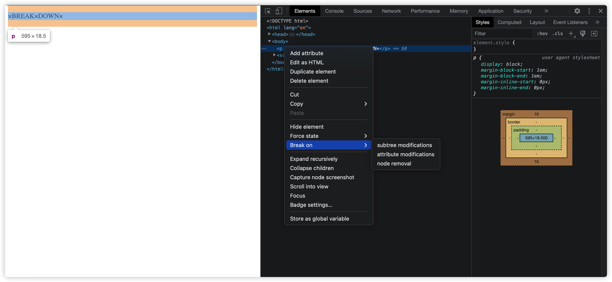

这期介绍了怎么使用了开发者工具。

# 知识点

## 断点调试
> 在按 F12 出现的 Chrome 开发工具中，在 Elements 选项卡之中，选择页面的某个标签（以 <p>为例），右键 → Break on → Attributes modifications。即可为该元素添加断点，当它的属性发生改变时，会自动定位到页面代码中的对应行。
>



## console.log() 
log 除了常规用法，还可以格式化输出，添加CSS格式输出等。

## console.dir()
跟python的dir()类似，dir 会输出这个 DOM 元素的属性列表。

## console.clear()
清空console已经打印输出的内容。

## 断言方法
这个应该各种语言都已经做到统一了？

```js
 console.assert(p.classList.contains('ouch'), 'That is wrong!');
```
## 计算程序运行时间

```js
console.time('fetch my data');
fetch("https://api.github.com/users/soyaine")
  .then(data => data.json())
  .then(data => {
  console.timeEnd('fetch my data');
  console.log(data);
});
```

## 数据分组展示
```js
const dogs = [{ name: 'Snickers', age: 2 }, { name: 'hugo', age: 8 }];
dogs.forEach(dog => {
	console.group();		
//	console.groupCollapsed();  // 收起列表
	console.log(`${dog.name}`);
	console.log(`${dog.age}`);
	console.log(`${dog.name} 有 ${dog.age} 岁了`);
	console.groupEnd();
});
```
## console.count()
计算count中的元素有几次。。感觉用处不大。

